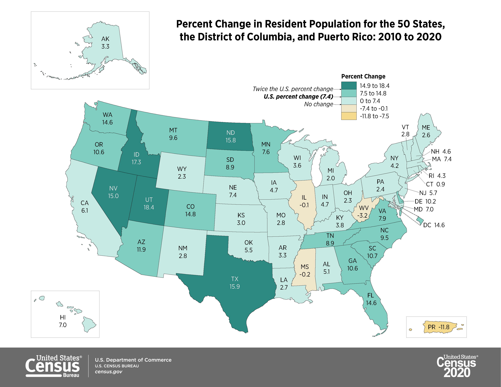
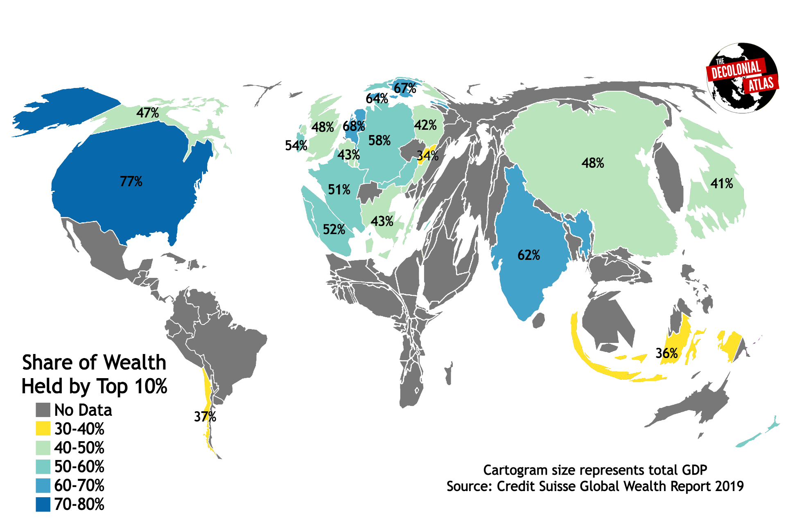

```{r setup, include=FALSE}
knitr::opts_chunk$set(warning = FALSE, message = FALSE, 
                      fig.retina = 3, fig.align = "center")
```

```{r packages-data, include=FALSE}
library(tidyverse)
# library(ggdag)
```

```{r xaringanExtra, echo=FALSE}
xaringanExtra::use_xaringan_extra(c("tile_view","broadcast"))
xaringanExtra::use_share_again()

```

class: center middle main-title section-title-1

# How is GIS applied to the scientific method?

.class-info[
Kyle Bocinsky
.light[FORS350 / GPHY488<br>(Forestry) Applications of GIS<br>University of Montana<br>
WA Franke College of Forestry & Conservation
]

]

---
#  Game plan

.box-inv-2.medium[The Scientific Method]

--

.box-inv-4.medium[The Geographic Approach]

--

.box-inv-7.medium[Geographic Representation]


---
class: center middle main-title section-title-4

# How do we know things about the world?
---

class: section-title-4 title-4 color-white

# How do we know things about the world?

--
Some ways of knowing:

- Personal experiences
- Cultural traditions
  - Education
  - Accumulation of historical and philosophical insights
- The Scientific Method
  - exploration
  - observation
  - experimentation
  - analysis

---
layout: false
name: class-details
class: center middle

#  What is the scientific method?


---
layout: false
class: title-01

#  What is the scientific method?
The modern scientific method is based on the work of René Descartes, one of the founders of contemporary Western science and philosophy. 

Four rules of Cartesian inquiry:

1. Accept nothing as true that is not self-evident
2. Divide each problem into as many parts as possible
3. Proceed from the simplest to the most complex
4. Review everything to avoid errors

---
layout: false
name: class-details
class: center middle

#  What is the scientific method?


---

layout: false
name: class-details
class: center middle

#  What is the geographic approach?


---

#  What is the geographic approach?

.pull-left.tiny[
.large[**Step 1: Ask**]
  - What is the problem to solve to analyze?
  
.large[**Step 2: Acquire**]
  - What data are needed to complete the analysis?
  
.large[**Step 3: Examine**]
  - How is it organized (schema)?
  - How does it relate to other data (topology)?
  - Where is it from (metadata)?
  
.large[**Step 4: Analyze**]
  - Process and analyze data to achieve desired results.
  
.large[**Step 5: Act**]
  - Present results as part of the decision-making process.

.large[**Data → Information → Knowledge!**]
]


.pull-right[


]

---
class: section-title-7 title-7 color-white

#  How do we form **spatial** hypotheses? 

It starts with an observation, which then leads to a question about what was seen.

 - While most things have a spatial component, it is worth asking if your observation has nothing to do with location.

 - Once you believe your question has a spatial component, you can convert it to a hypothesis to be tested with GIS.

.center[**The Geographic Approach can be thought to be nested within the hypothesis/experiment/analysis phase of the Scientific Method.**]

---
class: section-title-1 title-1 color-white

#  How do we form a spatial hypotheses? 

**1. OBSERVATION**

Trees at the top of the slope are dying.

--

**2. QUESTION**

Does elevation have anything to do with tree health?

--

**3. HYPOTHESES**

More trees die at higher elevations than at lower elevations.

--

**4. EXPERIMENT**

Randomly sample trees at different elevations to see if significantly more are dying on higher slopes.


---
#  Applications of GIS 

What kinds of spatial problems can you use a geographic information system to answer?

---
class: center


---
class: center


---
class: center


---
class: center


---
class: center


---
class: center


---
#  How is the Scientific Method applied with GIS ? 

.center[
What farmers markets are within 30 miles of the Trans America Trail?


]


---
#  How is the Scientific Method applied with GIS ? 

.center[


]

---
class: section-title-3 title-3 color-white center

# Can Missoula meet its electricity needs<br>with roof-top solar? 


The earth at sea level receives about 1,000 Watts per square meter.

How can we use GIS to answer this question? What data do we need?

---
class: center

#  What is Thematic Cartography? 


---
class: center


---
class: center

#  The Point… is to turn this: 


---
class: center

#  Into This!



---
class: center
#  REFERENCE 


---
class: center
#  QUALITATIVE 


---
class: center
#  QUANTITATIVE CHOROPLETH 


---
class: center
#  QUANTITATIVE PROPORTIONAL SYMBOL 


---
class: center
#  QUANTITATIVE ISARITHMIC 


---
class: center
#  QUANTITATIVEDOT DENSITY 


---
class: center
#  QUANTITATIVE CARTOGRAM 



---
class: center
#  QUANTITATIVE FLOW 


---
class: center
#  QUANTITATIVE MULTIVARIATE 


---
class: section-title-7 title-7 color-white center
#  SO WHAT's IMPORTANT? 

.large[**Make maps people want to look at!**]

A good Map gives the user access to the data that is not readily available in the table. GIS answers questions that only spatial analysis can!

(It also should keep their eyes from rolling back in their heads as they drift off to a happy place!)


